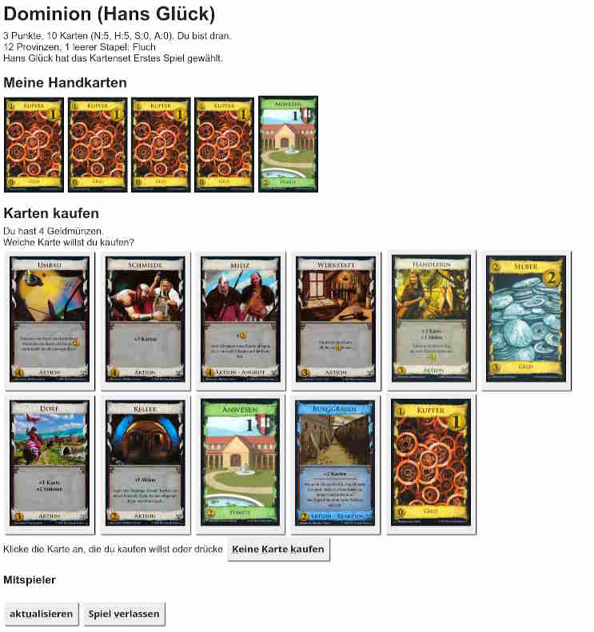

# Dominion – Online-Kartenspiel

Hier ist das Kartenspiel [Dominion] als Online-Spiel. Es ist in reinem Java 8 ohne externe Abhängigkeiten programmiert.

## Installation

1. Lade vom [jüngsten Release] die Datei Dominion-x.y.z.zip herunter und entpacke sie.
2. Stelle Kartenbilder in das Verzeichnis `p/dmn/` (siehe: Kartenbilder)
3. Starte `java -jar Dominion.jar 80`  („80“ ist der HTTP-Port).
4. Rufe [http://localhost:80](http://localhost:80) auf.

## Inhalt

Die aktuelle Version umfasst
* das **Basisspiel** (1.+2. Edition)
* die Erweiterung **Intrige**

Insgesamt also 65 Karten.

## Konzept

Für jeden Mitspieler wird eine Liste von Aufgaben geführt. Für den Spieler am Zug sind das meistens:
1. Aktion ausspielen
2. Karte(n) kaufen
3. Aufräumen

Je nach Karte können sich für alle Mitspieler jederzeit neue Aufgaben ergeben.

## Kartenbilder

Aus rechtlichen Gründen will ich lieber keine Bilder für die einzelnen Karten mitliefern.

Diese finden sich aber in hoher Qualität im [Dominion Strategy Wiki].
Sie können auch mittels des hervorragenden [Dominion Card Image Generator] individuell erstellt werden.

Welche Kartenbilder genau benötigt werden, steht in der Datei [Karte.java]. Es ist jeweils der englische String als vierter Parameter plus „`.jpg`“.

Das Kartenbild für den Burggraben beispielsweise wird als `p/dmn/Moat.jpg` erwartet. Empfohlene Auflösung: 320x200 Pixel.

## Screenshot

## Autor & Kontakt

Roland M. Eppelt [r.eppelt@ulde.de]

## Lizenz

Der Code steht unter der GNU Affero General Public License 3.0.

[Dominion]: https://de.wikipedia.org/wiki/Dominion_(Spiel) "Wikipedia-Artikel anzeigen"
[jüngsten Release]: https://github.com/ulde1/Dominion/releases/latest
[Dominion Strategy Wiki]: http://wiki.dominionstrategy.com/index.php/Category:Card_images
[Dominion Card Image Generator]: https://shardofhonor.github.io/dominion-card-generator/index.html
[Karte.java]: https://github.com/ulde1/Dominion/blob/main/src/de/eppelt/roland/dominion/Karte.java
[r.eppelt@ulde.de]: mailto:r.eppelt@ulde.de
